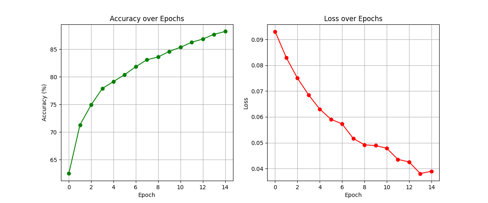
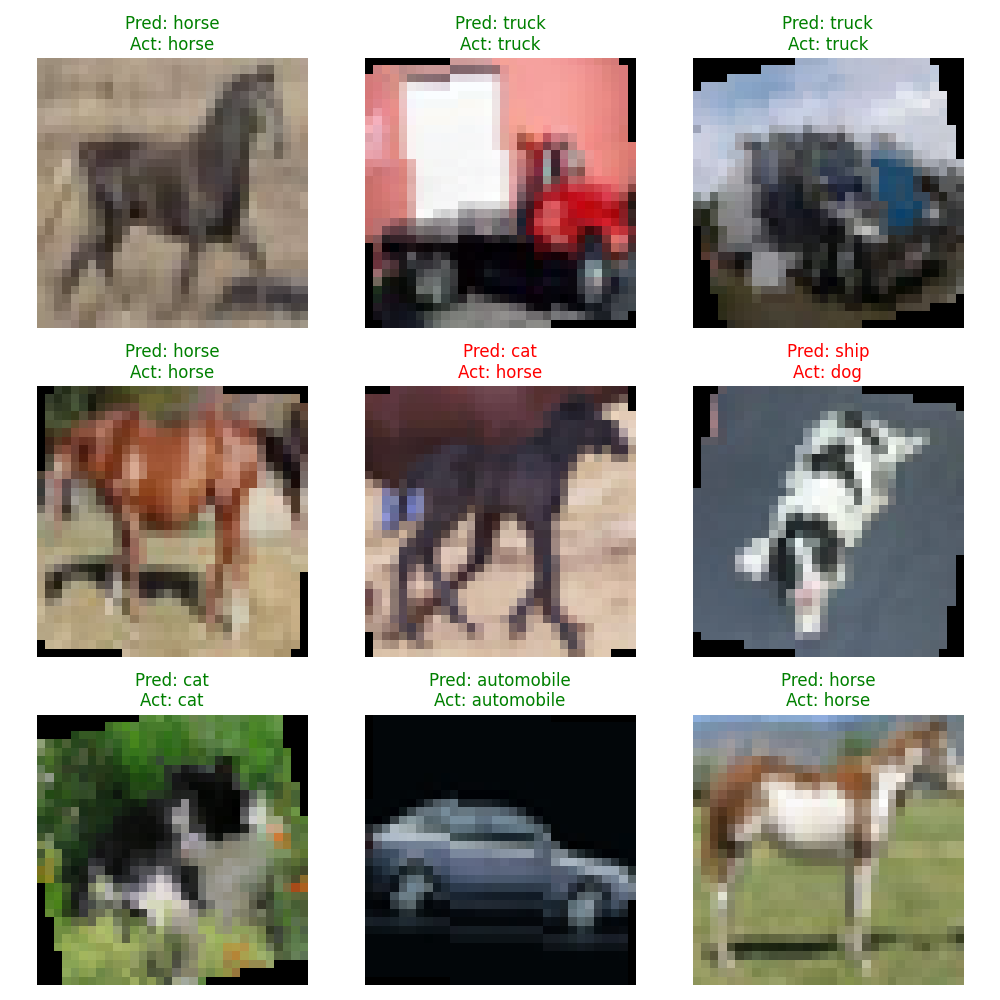
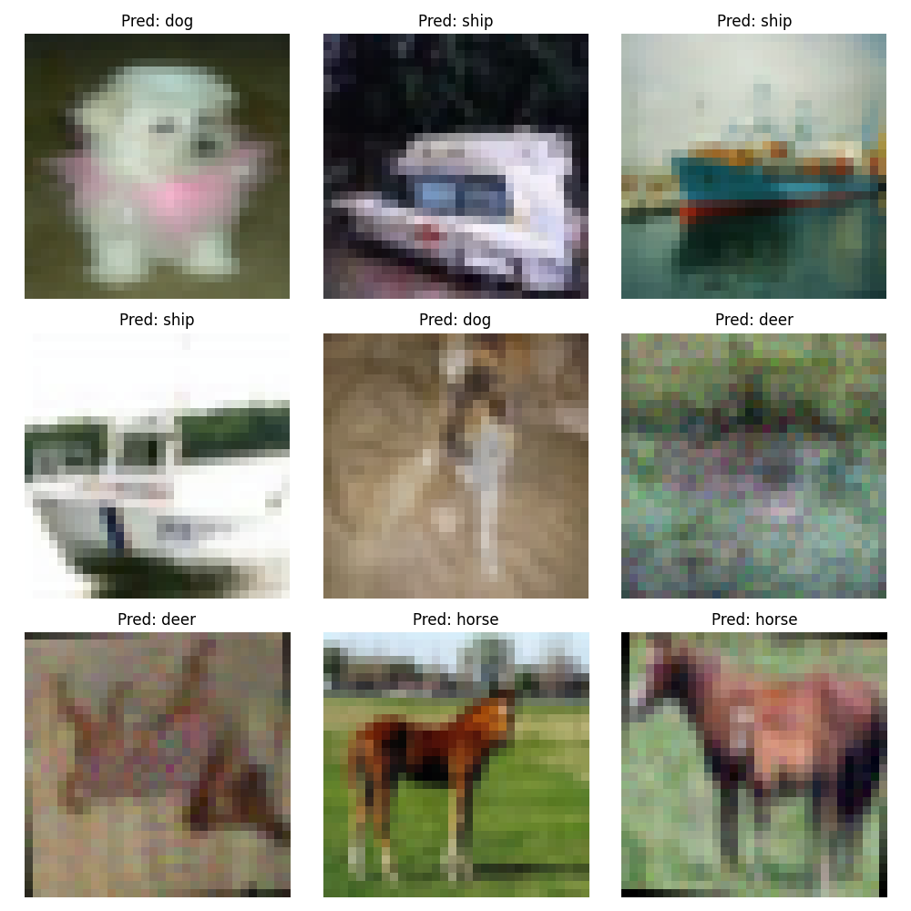

# 🐸 CIFAR-10 Image Classification Challenge


## 📌 Project Overview
This repository contains a complete, end-to-end Machine Learning pipeline to solve the famous [Kaggle CIFAR-10 Competition](https://www.kaggle.com/c/cifar-10). The goal is to classify `32x32` pixel RGB images into exactly 10 distinct, mutually exclusive categories (airplane, automobile, bird, cat, deer, dog, frog, horse, ship, truck).

Unlike starter datasets (like MNIST), this project uses **raw physical image files** (`.png`) and heavily relies on modular project architecture, custom PyTorch Datasets, Data Augmentation, and Transfer Learning.

---

## 📂 Workspace Structure
The project is built using professional, modular architecture to separate the data pipeline, the "brain" (models), and the "directors" (training/submission scripts).

```text
📦 CIFAR-10/
├── 📁 data/                  # Ignored by Git. Contains physical train/test .png files
├── 📁 saved_models/          # Trained weights (.pth), metrics (.json), and plots
│   └── 📁 ResNet18/
│       └── 📁 plots/         # Loss curves and prediction grids
├── 📁 src/
│   ├── 📁 data/              # Data downloading, exploration, and custom PyTorch Datasets
│   ├── 📁 model/             # Neural Network Architectures (Custom CNN & ResNet)
│   ├── 📁 train/             # Training loop scripts
│   ├── 📁 submit/            # Inference and CSV generation for Kaggle
│   └── 📁 utils/             # Reusable visualization and plotting functions
├── .env                      # Secure Kaggle API token storage
└── README.md
```

---

## 🧮 Data Preprocessing & Augmentation
Because the dataset consists of 50,000 raw training images, we cannot load them all into RAM at once. 
We wrote a Custom `Dataset` class (`CIFAR10KaggleDataset`) to load images iteratively, accompanied by dynamic Data Augmentation to prevent overfitting.

* **Augmentations:** `RandomHorizontalFlip (p=0.5)` and `RandomRotation (15 deg)`.
* **Zero-Centering:** Images are normalized mathematically. For our Transfer Learning model, we use exact ImageNet metrics (`mean=[0.485, 0.456, 0.406], std=[0.229, 0.224, 0.225]`) to prevent the pre-trained brain from becoming "colorblind".
* **DataLoaders:** Batched into chunks of `64` to maximize GPU parallelization.

---

## 🧠 Model Architectures

### 1. Baseline Model: Custom CNN (From Scratch)
Built entirely from scratch using PyTorch `nn.Conv2d` blocks.
* **Architecture:** 3 Convolutional Blocks (Conv $\rightarrow$ ReLU $\rightarrow$ MaxPool2d), followed by Flattening, and 2 Linear layers.
* **Math:** Reduced the `32x32` images down to `4x4` grids with 128 feature channels.
* **Performance:** Achieved **74% Accuracy** on the Kaggle Leaderboard after only 5 epochs!

### 2. Advanced Model: Transfer Learning (ResNet-18)
To break past the 74% baseline, we implemented **Transfer Learning**.
* **Architecture:** We downloaded a pre-trained `ResNet-18` model (which uses revolutionary "Skip Connections" to prevent the vanishing gradient problem).
* **Fine-Tuning:** The original model was trained to predict 1,000 classes. We "chopped off the head" by replacing the final Fully Connected (`fc`) layer with a brand-new, blank 10-output linear layer.
* **Training:** We fine-tuned the model, allowing the brand new output layer to learn how to interpret the genius signals coming from the convolutional layers.
* **Performance:** Achieved **82.44% Accuracy** on the Kaggle Leaderboard, a massive leap from our 74% baseline!

---

## 📊 Visualizations & Results
*Plots are generated dynamically in the `saved_models/ResNet18/plots` directory upon training completion.*

<details>
<summary><b>📉 1. Training Metrics (Click to Expand)</b></summary>
<br>
We mathematically track the model's learning progress (Loss) and Accuracy over the epochs to ensure it converges efficiently without overfitting to the training data.
<br><br>

<br>
</details>

<details>
<summary><b>👀 2. Training Set: Prediction vs Actual (Click to Expand)</b></summary>
<br>
A visual sanity check comparing the model's outputs against the true labels on the training set.
<br><br>

<br>
<i>(Note: Green text indicates a correct prediction, Red indicates an incorrect prediction).</i>
</details>

<details open>
<summary><b>🚀 3. Kaggle Test Set: Final Blind Predictions (Click to Expand)</b></summary>
<br>
This grid shows the model's "blind" predictions on the completely unlabelled Kaggle Test Dataset right before the CSV was generated for submission!
<br><br>

</details>

---

## 🚀 How to Run

1. **Extract Data:** Run `src/data/data.py` to securely download the Kaggle dataset via your `.env` token.
2. **Train Model:** Run `src/train/train_resnet.py`. This will generate the `saved_models/` folder, the plots, and the `.pth` weights file.
3. **Generate Submission:** Run `src/submit/submit.py` to push the 300,000 test images through the GPU and output `submission_resnet.csv`.
